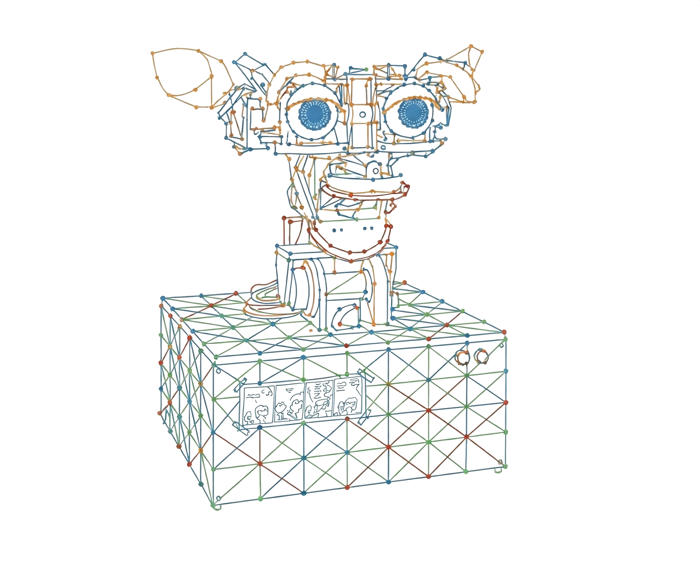

<!-- Google tag (gtag.js) -->

<h1 class="site-title">Xiaolong Yang</h1>

<!-- Art Option 1: Neural Connection Symphony -->

  

    <canvas id="neuron-canvas" role="img" aria-label="Interactive neural network visualization showing neurons connected by dendrites with animated synaptic signals"></canvas>
    

      <em>Neural Connection Symphony</em> visualizes the invisible music of thought. Each neuron fires with biologically-accurate action potentials—sharp depolarization flashes followed by refractory "cooling" periods. Signals cascade through dendrites using saltatory conduction, while calcium blooms mark synaptic arrivals. The psychedelic color palette evokes altered states where creativity flourishes. Click any neuron to trigger a cascade; the burst particles follow actual dendrite angles, simulating back-propagating action potentials. This is consciousness rendered visible: the tension between organic unpredictability and algorithmic precision.  
      <em>Inspired by Neuropit #13 by the Zairja Collective. Created with Claude AI.</em>
    

  

<!-- Art Option 2: Kismet -->

  

    
    

      <em><a href="http://www.ai.mit.edu/projects/humanoid-robotics-group/kismet/kismet.html">Kismet</a></em> is an expressive anthropomorphic robot developed by <a href="https://www.media.mit.edu/people/cynthiab/overview/">Cynthia Breazeal</a>, designed to engage people in natural face-to-face interaction through facial expressions, gaze, and vocal babbles—embodying how social and computer systems can meaningfully interact.
    

  

<!-- Random art selection and conditional script loading -->

Welcome! I am a G2 graduate student in Harvard University's Master's program of [Regional Studies - East Asia](https://rsea.fas.harvard.edu) at the Kenneth C. Griffin Graduate School of Arts and Sciences.

My CV can be found [here](pdfs/cv_xly_web.pdf).

## intellectual pursuits

I am broadly interested in the interplay between important technologies and foundational human systems. 

### statistical software
I have worked on the [`evalITR`](https://github.com/MichaelLLi/evalITR) R package to expand its support for causal machine learning methods for estimation and evaluation of individualized treatment rules, and more generally heterogeneous treatment effects.

### book
My amazing coauthors and I delivered an open source book on the applications of R Markdown in Chinese.

Chunhui Gao, Yifan Wang, Qiushi Yan, Liangliang Zhuang, **Xiaolong Yang**.  
[An Authoritative Guide for R Markdown (Tentative English Title).](https://cosname.github.io/rmarkdown-guide/) Open-source Publication. 2023.

## teaching

Teaching and learning are bonded intellectual activities. I am particularly thankful to Prof. [Kosuke Imai](https://imai.fas.harvard.edu/) and Prof. [Connor Jerzak](https://connorjerzak.com/). Thanks to them, I had many opportunities to learn and teach. 

I was fortunate to be a part of Prof. [Kosuke Imai](https://imai.fas.harvard.edu/)'s teaching team for the celebrated introductory level data science course for social scientists - [QSS](https://kosukeimai.github.io/qss-todai/) at the University of Tokyo in 2022. We taught a series of TA lectures on tidyverse - a popular syntax of R. Slides are provided [here](https://github.com/xiaolong-y/qss-inst-tidyverse).

## miscellaneous

Non-academically, I write on my [bear blog](https://xiaolongy.bearblog.dev) occasionally.

I also keep my favorite [quotes](quotes.md), [bookshelf](bookshelf.md), and [thought snippets](ephemeral-thoughts-final.html) here. I created a collection of interactive [cognitive bias](cognitive-biases.html) visualizations in collaboration with [Claude Code](https://claude.ai/code).

---

  
  
  
  

  Many thanks to <a href="https://jtibshirani.github.io/">Julie Tibshirani</a> for showing the perfect implementation of a lightweight website.

