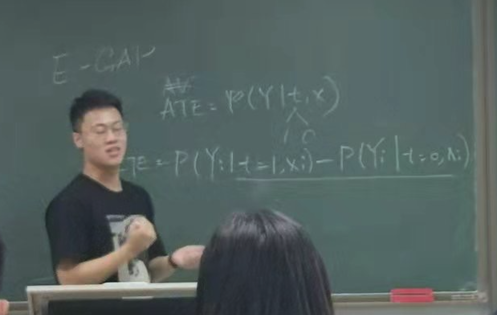

# Xiaolong Yang

Hi! I am a final year undergraduate student at the University of Tokyo working towards a PhD in computational social science. From 2021 to 2022, I also studied at NUS FASS and Peking University *Yuanpei* College as an exchange student.

## Research

I love doing research in the intersections of causal statistical machine learning and political methodology. My substantive interests span from political behaviour in comparative politics to security in international relations. 

I currently work on the [`evalITR`](https://github.com/MichaelLLi/evalITR) R package to expand its support for causal machine learning methods for estimation and evaluation of heterogeneous treatment effects.

## Book

My amazing coauthors and I are delivering an open source book on the applications of R Markdown in Chinese.

Chunhui Gao, Yifan Wang, Qiushi Yan, Liangliang Zhuang, Xiaolong Yang.
[An Authoritative Guide for R Markdown (Tentative English Title). China Machine
Press.](https://cosname.github.io/rmarkdown-guide/) Forthcoming in 2023.

## Teaching

Through teaching is knowledge preserved, hence the possibility of research. I was hugely inspired by the great teaching of those before me that I have developed a deep interest in teaching no less than that of doing research.

I had the fortune to be a member of Prof. [Kosuke Imai](https://imai.fas.harvard.edu/)'s teaching team in 2022 to teach the celebrated introductry data science course for social scientists - [QSS](https://kosukeimai.github.io/qss-todai/) at the University of Tokyo. We also taught a series TA lectures on Tidyverse - a syntax of R, slides of which are provided [here](https://github.com/xiaolong-y/qss-inst-tidyverse).

------------------------------------------------------------------------

 Many thanks to <a href="https://jtibshirani.github.io/" target="_blank">Julie Tibshirani</a> for showing the perfect implementation of a lightweight website.
