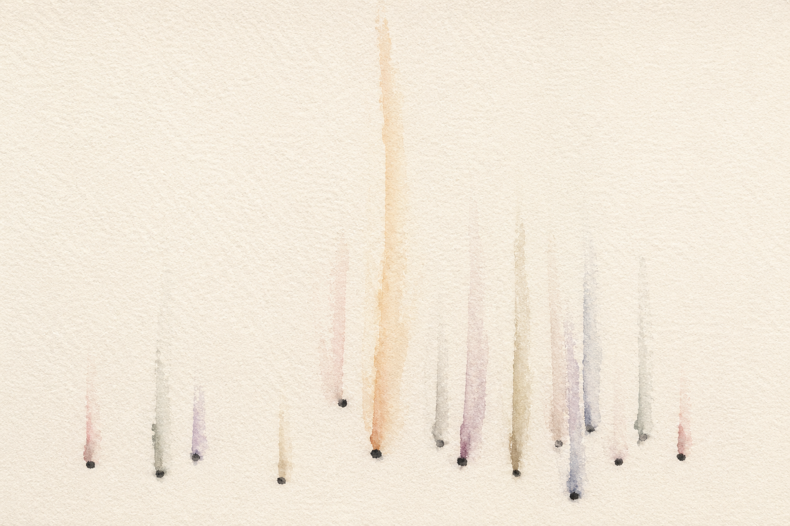

<ul class="site-nav">
  <li><a href="/">Home</a></li>
  <li><a href="../pdfs/Resume_XiaolongYang_27.pdf">Resume</a></li>
  <li><a href="../research.html">Research</a></li>
  <li><a href="../software.html">Software</a></li>
  <li><a href="../teaching.html">Teaching</a></li>
  <li><a href="../bookshelf.html">Bookshelf</a></li>
  <li><a href="./">Blog</a></li>
  <li><a href="../quotes.html">Quotes</a></li>
  <li><a href="../labs/">Maker Space</a></li>
</ul>

<!--
  ┌─ colophon ─────────────────────────────────────────────────────────────┐
  │ image: assets/images/music_plot.png                                    │
  │ model: GPT-5.5 (extended thinking)                                     │
  │ prompt:                                                                │
  │   A minimal watercolor on cream paper. Landscape orientation, 3:2.     │
  │   The vast majority of the page — at least 80% — is untouched paper.   │
  │   The image is mostly absence.                                         │
  │                                                                        │
  │   Scattered across the lower third of the page, irregularly spaced     │
  │   and at varying distances, are roughly twelve to fifteen small marks. │
  │   Each mark is just a single soft dot or a tiny smudge of sumi ink,    │
  │   no larger than a grain of rice. They are not arranged on a line or   │
  │   grid; they sit at different depths, some clustered, some isolated,   │
  │   like seeds dropped on a table.                                       │
  │                                                                        │
  │   From each of these marks, a single faint column of color rises       │
  │   vertically into the empty space above. The columns are translucent   │
  │   watercolor wash — barely there — in muted, unsaturated tones: a      │
  │   pale dusty rose, a soft ochre, a faded indigo, a cool grey-green,    │
  │   a warm sand, a quiet lavender. Each column is a slightly different   │
  │   color. The columns vary in height — some rise only a short way       │
  │   before dissolving, others reach two-thirds up the page. They are     │
  │   not uniform; they have the irregular edges of watercolor bleeding    │
  │   into dry paper, wider at the base, thinning as they rise,            │
  │   dispersing into nothing at the top.                                  │
  │                                                                        │
  │   Where two or three columns happen to cross or overlap in the middle  │
  │   of the page, the colors gently mix into a third tone — never a       │
  │   sharp intersection, always a soft wash where one breath has met      │
  │   another.                                                             │
  │                                                                        │
  │   No horizon line. No ground. No sky. No figure. No moon. No           │
  │   mountains. No network lines, no connecting threads, no dots in the   │
  │   sky. The paper has no top and no bottom — only a field of quiet      │
  │   vertical rising.                                                     │
  │                                                                        │
  │   The marks at the base are the only crisp element; everything above   │
  │   is wash, vapor, suggestion. The composition is asymmetric — more     │
  │   density on one side of the page, more emptiness on the other. One    │
  │   column should be noticeably taller and warmer than the rest, near    │
  │   but not at the center.                                               │
  │                                                                        │
  │   Medium: real watercolor and sumi ink on cold-press paper. Visible    │
  │   paper grain. No digital effects, no glow, no smoothness, no          │
  │   symmetry. The image should look like something a careful hand made   │
  │   in twenty minutes, not something rendered.                           │
  │                                                                        │
  │   Mood: the silence in a room after a single note has been played      │
  │   and is still travelling.                                             │
  └────────────────────────────────────────────────────────────────────────┘
-->

<figure class="post-hero">
  
</figure>

# My favorite things (music)

20 Aug 2025

Someone once said that poetry expresses the inexpressible. In turn, people read it to understand what they cannot quite comprehend or process. Over time, the poetry that helps people experience the world better stays alive.

What also expresses the inexpressible is music. Music is a unique form of expression. Unlike other symbolic systems, we compose (and sometimes don't) and communicate it through vibrating air molecules with instruments. Our nervous systems then pick up this information and process it as electrical and chemical signals in our brains. Somehow, music then moves our hearts and minds in profound ways.

The music world is vast. Since I claim no confidence to review it comprehensively, I would like to share my experience as an listener.

My experiences are deeply personal. What I share in this blog is just a subset of music from a slightly larger subset that I've heard and remember, which is a subset of an even larger subset that I am aware of, and is a tiny subset of a much, much larger set of music that includes all that is produced and alive.

Nonetheless, sharing this tiny subset is fun. For me, blogging about it helps me understand the world and myself better. For others (hopefully), reading this could help them gain different perspectives and experiences with the particular music you see below.

I curated the list below following these conditions, albeit loosely.

- musicians first, songs second
- prioritize musicians that in my cognition are the most connected in terms of (various) music network(s)
- songs that sound good
- songs created under the conscious influence of larger forces, i.e., social and technological revolutions, and constant themes of human experience

## Karajan

[The Planets, Op. 32: 4. Jupiter, the Bringer of Jollity](https://www.youtube.com/watch?v=wvfz23jZz6c)

This classic piece piqued my curiosity about many things in the universe. The combination of notes is grandiose and vast. At times I can hear agile notes of jollity weaving in and out of the main melody. It taught me a lot about the universe, the world, and myself, in ways other media could not.

[Pictures at an Exhibition: Promenade I (Orchestrated by Ravel)](https://www.youtube.com/watch?v=cRG5Nk9vGIA)

What was your first impression of something so great that it can be called achievement? What was your understanding of progress? This song offers some food for thought. Listening to this music also makes me think of the trials and tribulations that humanity has encountered throughout history (brief as it is). And yet, we move forward.

I must say I cheated a little here by not naming the amazing composers--Modest Mussorgsky and Gustav Holst. The reason is because I mainly got to know their pieces through Karajan's work. In this sense Karajan is the starting point of my classical-music listening journey.

## Sakamoto Ryuichi

Tong Poo

The melodies of this piece are amazing, and yet Sakamoto's execution can make listeners interpret the same piece incredibly differently. He recorded the [BTTB version](https://www.youtube.com/watch?v=530w0HLOJWA) when he was about 46 years old. Each note is so powerful; it sounds like a rushing waterfall. Whereas the final recording on [Opus](https://www.youtube.com/watch?v=hD7bgf9_CoA) is much slower and well-paced. I hear reflections--perhaps flashes of memories. It is impossible to know exactly how he felt, but many years of worldly experience completely transformed Sakamoto's performance of this piece.

Yet another classic. The repetitive notes are contemplative. It sounds like a gentle and curious inward inspection of the self--how are you doing, and what is on your mind?

The notion of a "chasm" implies the increasing social and environmental problems that Sakamoto-san had been concerned about at the time. This album is one of the most political that he produced. It conveys a deep sense of anti-war sentiment. Listening to this album I became convinced that he genuinely believes in the power of music to make the world a better place. [弥勒世果報 (みるくゆがふ/mirukuyugafu)-- "Undercooled"](https://www.youtube.com/watch?v=OQNTcoayZ3E) is another beautiful version. The collaboration between [Unaigumi](http://www.unaigumi.com/profile.html) (an Okinawa-based music group) transformed this song into an elegy, one of humanity's most ancient languages of love.

[Merry Christmas Mr. Lawrence](https://www.youtube.com/watch?v=4Jm3mI6GF8E) in The Best of "Playing the Orchestra 2014" 2nd

Everyone who knows Sakamoto-san likely knows this song. He performed this live when he was unaware that cancer was developing in his body. I watched the cinema version of the recording in a film theater in Osaka exactly ten years later, which was one year after he passed away. Seeing the level of vitality he exhibited was deeply moving. He chose to perform this piece second to last, and when the drums started to kick in around three minutes thirty seconds, I felt completely engulfed in Sakamoto's imagination. Looking back, it also felt powerfully religious. Everyone in the theatre was extremely quiet and felt like being in his presence. My father fell suddenly ill around the time Sakamoto passed, and it was a life-changing experience for me. For this reason, I also started to see this song as a salute to the beauty of life and love--in particular, a reminder of the number of moons we still get to see with our significant others.

## Glenn Gould

I decided not to point to any of Gould's specific music. His recordings throughout his career form a condensed book about life. One only needs to flip through the pages.

## Toe

[Guddo Bai](https://www.youtube.com/watch?v=e1pZIfretEs) in New Sentimentality -- EP

Everything about toe started with this track for me. Toe has been an educational presence for me because it not only enriched my listening through its unique instrumental expressions, but also helped me cope with alone time better. I probably grew up better because of them since I had a very "nomadic" upbringing and had to manage many things on my own as a kid. So thank you, Toe!

## GoGo Penguin

[Everything Is Going to Be OK](https://www.youtube.com/watch?v=DolDqHG6FSI) in Everything Is Going to Be OK

I needed a voice to tell me things were going to be okay when I was wrapping up my undergraduate studies in Tokyo. And this song was it. Its beautiful combinatorics of notes and instruments became an anchor voice to reaffirm that I can do things, and I really appreciated it. It also reminded me of the cyclic nature of many things in this world, which was enlightening. Together with [You're Stronger Than You Think](https://www.youtube.com/watch?v=AaHcNZnXfco), I received powerful messages that got me through rough patches.

[Raven](https://www.youtube.com/watch?v=25_eBLio0FU) in A Humdrum Star

In comparison, I appreciate "Raven" for its musicality. We all have weird dreams. Listening to "Raven" is like giving the mind an excuse to fly somewhere else and daydream something different.

## Of Monsters and Men

My favorite high-school teacher in sixth form--Mr. Stoddart--used to play the music video of this song before every single class he taught. Around ten years later, this song now embodies all the memories of discussing random things with one of the most affectionate and peculiar science teachers ever, the beautiful friendships, poking around with Bunsen burners in a lab, and all the fun walks I went on in a rural and removed British town.

## Bob Dylan

[Blowin' in the Wind](https://www.youtube.com/watch?v=cQBVgtcR2rM) in The Freewheelin' Bob Dylan

Any words feel pale to introduce this song. Winds, the sea, friendships, mountains, answers to life, and love--every theme this song touches on pertains to the eternal and collective human experience. For this reason, this song will always live.

[Don't Think Twice, It's All Right](https://www.youtube.com/watch?v=Kv7K9ghgcgA) in The Freewheelin' Bob Dylan

When I need courage and wisdom to make big decisions in life, I resort to this song for a lighthearted recipe. And it works.

Bob Dylan is, quite uncontroversially, one of the most prominent folk singers ever. Because of him, I also resonate more deeply with artists like Novo Amor and Damien Rice.

## Egschiglen

[Nutgiin zamd](https://www.youtube.com/watch?v=g_kbwVpmv9A) in Gereg

Apparently this song translates to "home road." Having been born in Inner Mongolia, Mongolian ethnic music has always felt special. Every summer when I was little, I would hear the music of [throat singing](https://en.wikipedia.org/wiki/Tuvan_throat_singing) and [morin khuur](https://en.wikipedia.org/wiki/Morin_khuur) on my family road trips.

[Shigshergiin ai](https://www.youtube.com/watch?v=dlXUnit_qnk&list=RDdlXUnit_qnk&start_radio=1) is another folk song that is prominent across many Mongolian cultures. My father grew up in the vast arid land of the Alashan Plateau. When he was as little as ten, herding goats was his home duty. I think he heard a lot of this "music" from that upbringing alone without necessarily hearing this exact song. For me, this is one of the few ways to reconnect with those roots.

## Bongeziwe Mabandla

[isiphelo (#Untitled)](https://www.youtube.com/watch?v=1iHhWh9FtsQ) in iimini

It is amazing that this South African singer composed such beautiful melodies with just a guitar, some drums, and his voice. He sang in [isiXhosa](https://en.wikipedia.org/wiki/Xhosa_language), a Bantu language. The song discusses love, and more specifically how certain loves do not cease to exist even after the relationship ends.

A young singer growing up in one of the least developed regions on earth, Bongeziwe raises a series of questions about the pursuit of money versus wealth, and corrupted local institutions.

## Milky Chance

[Down by the River](https://www.youtube.com/watch?v=qlGQoxzdwP4&list=RDqlGQoxzdwP4&start_radio=1) in Sadnecessary

I recommend listening to the entire album. There are many classic songs that mix punchy drum beats, husky singing, and a sense of country such as [Fairytale](https://www.youtube.com/watch?v=EhGPkdG8Rko), [Stolen Dance](https://www.youtube.com/watch?v=iX-QaNzd-0Y), [Flashed Junk Mind](https://www.youtube.com/watch?v=r8BsuT0PWdI). It is one of the rare albums that lets you embrace both fun and sadness at the same time. Sadnecessary was my remedy when I first lived alone in a foreign country. Down by the River was the song that I woke up to when studying chemistry at 6 a.m.

## Nujabes

[Reflection Eternal](https://www.youtube.com/watch?v=2wK27xW4OFI) in Modal Soul

The one and only album in many people's minds. I think it is a masterpiece because it is deeply poetic. Of course it has great sampling taste, but I would argue Nujabes' unique sensibility led him to see the connections he could draw across different genres. This is an album one could hear anywhere and anytime. IMO, Reflection Eternal above all embodies his taste the best.

[Luv(sic), Pt. 6 (Uyama Hiroto Remix)](https://www.youtube.com/watch?v=wttQFlJqNU8) & [Spiritual State (feat. Uyama Hiroto)](https://www.youtube.com/watch?v=jwpFBWZARWo)

Nujabes' collaboration with Uyama Hiroto refined his poetic delivery to a more flowy state. You will notice the beats are faster, and the piano keys are brighter. Great collaboration in any field surely makes the world a better place, and these songs are an example.

One of the most asked questions on Reddit seems to be "If you like Nujabes, what other music do you listen to?" My immediate answer is Haruka Nakamura.

## Daft Punk

Daft Punk has been a revolutionary force in music. We would not be aware of the full impact they had on electronic music--and contemporary music at large--just by listening to them. Motherboard is a fun piece to listen to if you need some extra rhythm to get into your groove/flow.

## Avicii

Avicii was one of the first musicians to combine country music with electronic. He helped transform the way people dance to music at parties or at home. The constant theme I sense from almost all his music is happiness. His music makes everyone happier and hence bonds people tighter. This is one of my father's favorite songs, and I thank Avicii for that.

Rest in peace, Avicii.

## Hayato Sumino

[Nocturne II: After Dawn](https://www.youtube.com/watch?v=b1tNlZwqmnk)

Recently Hayato-san is starting to gather meaningful traction both online and in the more serious world of music. Online, he has a virtual personality called [Cateen](https://www.youtube.com/channel/UC_QG8miwKHFNuWY9VpkrI8w) and has uploaded many awesome performances. He composed this piece himself and played it gracefully.

[Bolero, M. 81 (Arr. for Piano by Hayato Sumino)](https://www.youtube.com/watch?v=G-pP2EaZiLQ)

This is simply a fun arrangement to listen to! In the music video you can see the creative ways Hayato reinforced the notes using two pianos. It is simply fun to imagine, each time you hear the song, a guy is playing two pianos for you.

Back in 2019, my close college friend (who is an amazing political scientist & pianist) interviewed Hayato-san for a Todai Shimbun piece. They discussed the future of classical music with artificial intelligence. The interview has an intriguing theme--[Is God necessary for music?](https://www.todaishimbun.org/symposium20200331_2/)

## Philip Glass

[Satyagraha: Act 3, Conclusion](https://www.youtube.com/watch?v=bWzgzE0J1oI) in Glass Cage performed by Bruce Brubaker [Satyagraha, Act I in _Philip Glass: Satyagraha](https://philipglass.bandcamp.com/album/philip-glass-satyagraha) (Recorded Live at the Met -- November 19, 2011)

Glass is a legendary figure in contemporary classical music. He deeply influenced the way classical music is created today. Over his prolific career, he produced numerous operas. Satyagraha is one of the best IMO. Listening to it is like being put in an empty room that is full of echoes--the echoes of the past, present, and future.

Glassworks & Interview with Philip Glass

[Opening](https://www.youtube.com/watch?v=UyqSPZoACwg) and [Floe](https://www.youtube.com/watch?v=P_GF5XS9ImQ) are definitely worth a listen. The elongated and delightful repetitions are far from boring and will bring you to a relaxing meditation. I also enjoyed listening to the short interview that Glass gave at the end of each piece on this album.

## Ólafur Arnalds

[saman: saman](https://www.youtube.com/watch?v=jzcWhWrDnAY) in re:member

Ólafur's music represents the beach. The beach creates meditative effects on the mind because of the calming force of nature. The sound of the waves is therapeutic. This music puts you on such a beach.

## Joey Alexander

[I Can't Make You Love Me](https://www.youtube.com/watch?v=VpFEVDJkmwA) in Continuance

My musician and East Asian music historian friend Chaoliang first brought me to one of Joey's live concerts in Cambridge, MA. I remember sheer talent oozing out of his music. In particular, I felt a lot of granular sentiments when he played I Can't Make You Love Me.

Since then I could not forget this song. When my family visited Tokyo the following year we went to see Joey at Blue Note Tokyo again. This time we all teared up a little hearing him play the same song. For this experience, Joey and his interpretation of this classic love song will always have a special place in my heart.

## J. Cole

[All My Life (feat. J. Cole)](https://www.youtube.com/watch?v=Z4N8lzKNfy4) in Almost Healed

In life, it is not about beating others. Neither is life a competition. The only goal in life should be getting best at getting better. This song reminds me of this positive note, and it reminds me of many significant individuals in my life.

[Note to Self](https://www.youtube.com/watch?v=H_mWYEifepI) in 2014 Forest Hills Drive

It's actually a melodic credit to others. Recognition through creative and sincere appraisal is so beautiful.

That is all from me this time. Please remember that if you have music to share to others, they will always appreciate you doing so!

---

Thanks to Michael Lee for their comments on this essay.

1. I define musicians broadly here. They include, but are not limited to: conductor, composer, singer, producer, and so on.
2. The same logic as Paul Graham's essay [Good Writing](https://www.paulgraham.com/goodwriting.html). For this reason, I am quite specific about the version and the recording of the songs. I hope I have specified these nuances unmistakably enough.
