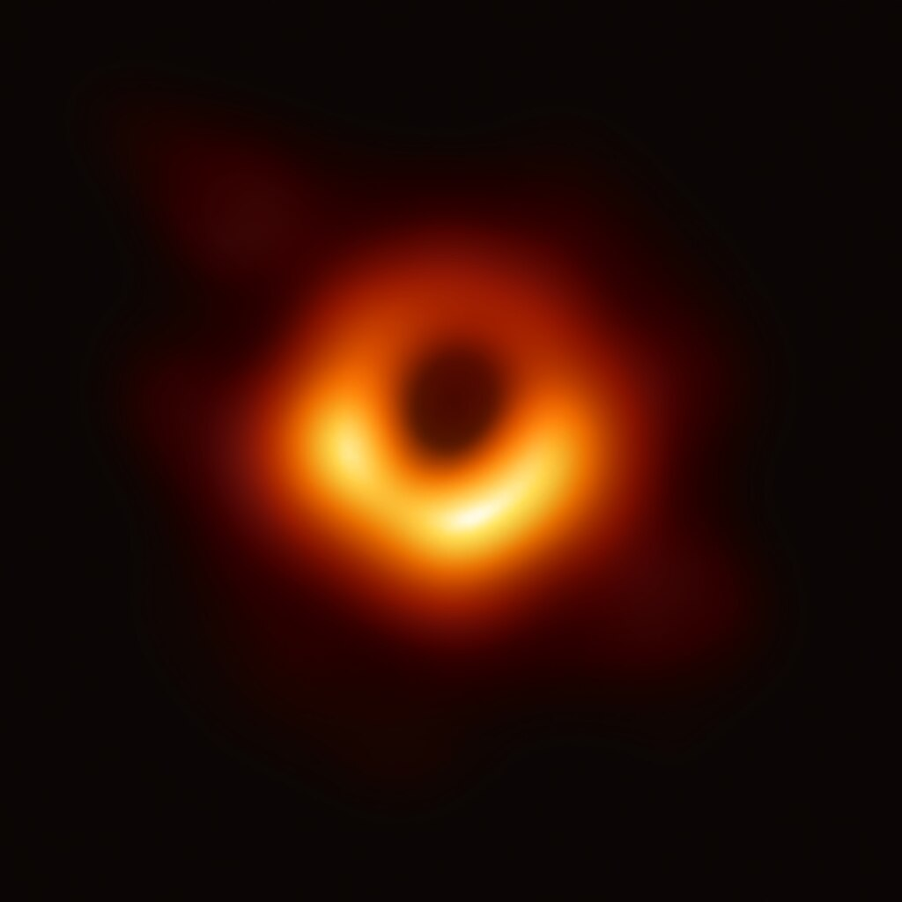

<!-- Google tag (gtag.js) -->

<nav class="nav-header">
  <a href="/" class="nav-link">
    &larr;
    Home
  </a>
</nav>

<h1 class="page-title">Inspirations</h1>

  These inspirations have had a profound influence on me. Their value lies not only in the solutions and perspectives they present, but in the reminder that others&mdash;often our heroes&mdash;have thought deeply about the same problems. That recognition is both heartening and humbling.

  

    "Brick walls let us show our dedication."
  

  
Randy Pausch

  

    "Follow your heart."
  

  
Kosuke Imai

  

    1. QUESTION dumb requirements 
    2. DELETE anything you can 
    3. SIMPLIFY/OPTIMIZE 
    4. ACCELERATE CYCLE TIME 
    5. AUTOMATE
  

  
Elon Musk

  
  
<a href="https://science.nasa.gov/mission/hubble/science/explore-the-night-sky/hubble-messier-catalog/messier-87/">M87*</a> — Seeing the unseeable

  

    <iframe src="https://www.youtube.com/embed/bvim4rsNHkQ" title="YouTube video" allowfullscreen></iframe>
  

  
Painful but good failures.

  

    <iframe src="https://www.youtube.com/embed/vGUNqq3jVLg?start=53" title="YouTube video" allowfullscreen></iframe>
  

  
Speak with buts and therefores.

  

    "What mysterious forces precede the appearance of the processes, promote their growth and ramification, stimulate the corresponding migration of the cells and fibres in predetermined directions, as if in obedience to a skillfully arranged architectural plan, and finally establish those protoplasmic kisses, the intercellular articulations, which seem to constitute the final ecstasy of an epic love story?"
  

  
Ramon y Cajal

  

    "Don't worry if you're winning or losing the fight. Just keep attacking!"
  

  
Connor Jerzak

  

    <em>Esse quam videri</em>
  

  
Marcus Tullius Cicero, <em>Laelius de Amicitia</em>

  

    "I learned very early the difference between knowing the name of something and knowing something. The first principle is that you must not fool yourself, and you are the easiest person to fool."
  

  
Richard Feynman

  

    <em>Nullius in verba</em>
  

  
Motto of the Royal Society

  

    "It's hard to do a really good job on anything you don't think about in the shower."
  

  
Paul Graham, <a href="https://www.paulgraham.com/top.html#f1n">The Top Idea in Your Mind</a>

  

    "Premature optimization is the root of evil."
  

  
Don Knuth

  

    "What ultimately matters in this course is not so much where you end up relative to your classmates but where you end up relative to yourself when you began."
  

  
David J. Malan, CS50

  

    "It is better to travel than arrive."
  

  
Robert Pirsig

  

    "Experience is what you get when you did not get what you wanted."
  

  
Randy Pausch

  

    "One does not have to be brilliant, a genius, to be special. To do something better than anyone else. To be UNMATCHED, one has only to choose an END&mdash;an END that MATTERS, that INSPIRES YOU&mdash;and then DO IT."
  

  
Manuel Blum

  

    "They could mock us, disregard us, use us to prop themselves up. But our teachers, if they are good, instead do something almost holy, which we never forget: they take us seriously. They accept us as new members of the guild. They tolerate the under-wonderful stories we write, the dopy things we say, our shaky-legged aesthetic theories, our posturing, because they have been there themselves.  We say: I think I might be a writer.  They say: Good for you. Proceed."
  

  
George Saunders

