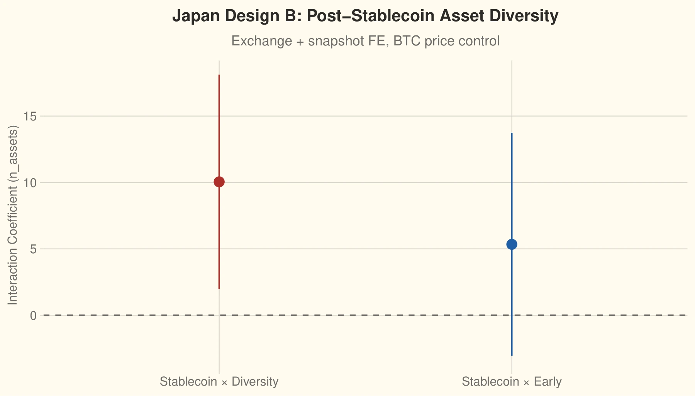
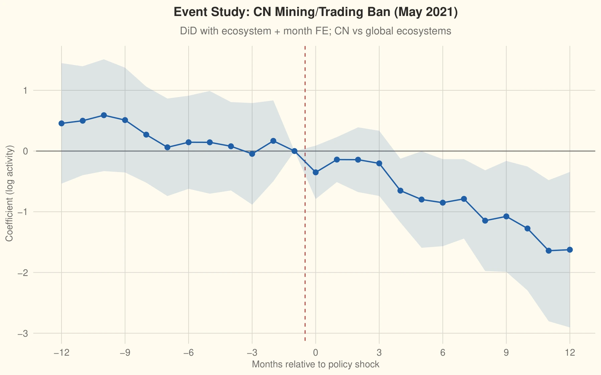

<!-- Research page: keep research material here rather than on the homepage. -->

<ul class="site-nav">
  <li><a href="/">Home</a></li>
  <li><a href="pdfs/Resume_XiaolongYang_27.pdf">Resume</a></li>
  <li><a href="research.html">Research</a></li>
  <li><a href="software.html">Software</a></li>
  <li><a href="teaching.html">Outreach</a></li>
  <li><a href="bookshelf.html">Bookshelf</a></li>
  <li><a href="blog/">Blog</a></li>
  <li><a href="quotes.html">Quotes</a></li>
  <li><a href="labs/">Labs</a></li>
</ul>

# Research

I was drawn to questions in political methodology and applied statistics, with a particular interest in causal inference, heterogeneous treatment effects, and empirical research designs for social science. Please see my [Google Scholar page](https://scholar.google.com/citations?hl=en&user=aXdIxxEAAAAJ) for more.

<section class="thesis" aria-labelledby="thesis-heading">
  <h2 id="thesis-heading">Master’s thesis</h2>
  <h3>The Political Economy of Blockchain Innovation: Institutions, State-Legible Firms, and Open-Source Development</h3>
  
A.M., Regional Studies East Asia · Harvard University · 2026 Advisor: Christina Davis

  
<strong>Abstract.</strong> How do political institutions shape blockchain innovations? I compare China and Japan, two institutionally distinct early adopters that govern blockchain through different governance channels. I compile original event-level data assets of domestic blockchain policy from 2013 to 2026. I link them to three new innovation outcomes: state-legible business activity in China, licensed exchange i.e., trading platforms activity in Japan, and blockchain open-source software activity associated with both countries. Using a number of identification strategies, the empirical evidence indicates that promotional policy does not reliably increase innovation volume, while restrictive policy reduces activity where it directly targets infrastructure or financial actors. In Japan, regulatory clarification expands the asset diversity for incumbent platforms with longer licensed history rather than increasing entry. In sum, states govern to structure the organizational forms, application domains, and channels which blockchain innovation becomes visible and durable.

  
Selected findings · click a figure to enlarge

  

    <figure>
      
      <figcaption><strong>Japan · Regulatory clarification</strong> After the stablecoin reform, already-diversified exchanges expanded their asset listings; the early-entrant estimate remains imprecise. Fig. 20.</figcaption>
    </figure>
    <figure>
      
      <figcaption><strong>China · Infrastructure restrictions</strong> Open-source activity declined after the May 2021 mining/trading ban, relative to global ecosystems. Shading shows uncertainty. Fig. 23d.</figcaption>
    </figure>
  

</section>

## Notes (from long ago)

- [Econometrics](pdfs/interecon.pdf)
- [How to replicate](pdfs/replicate.pdf)

## Related Work

My dated (since 2023) academic CV is available [here](pdfs/cv_xly_web.pdf).
