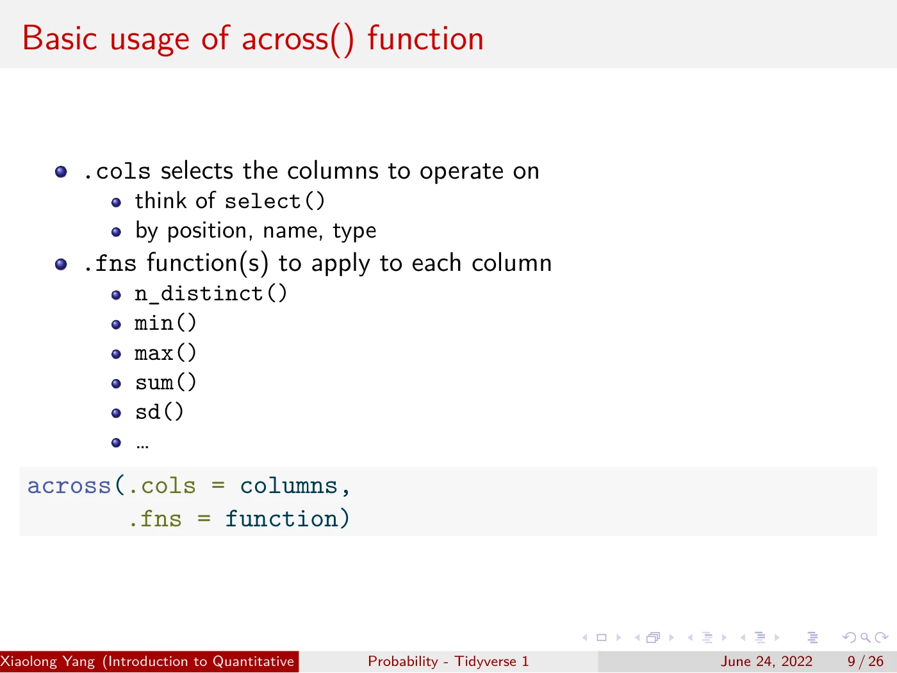
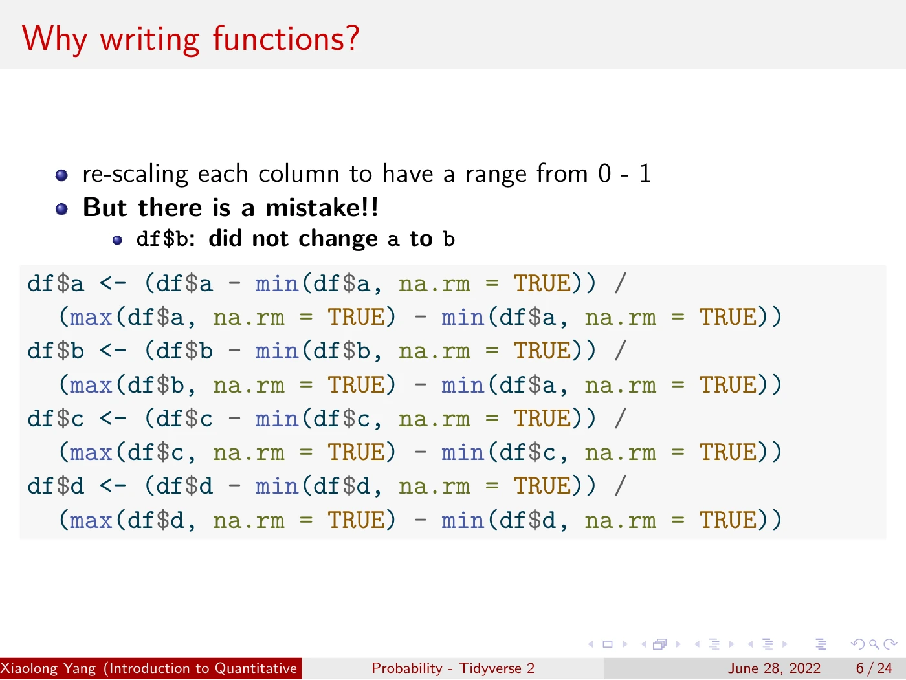
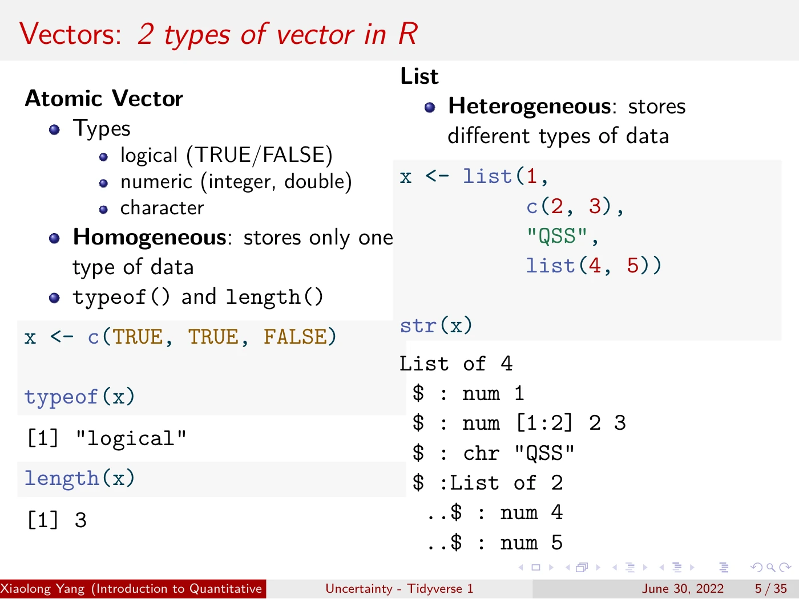
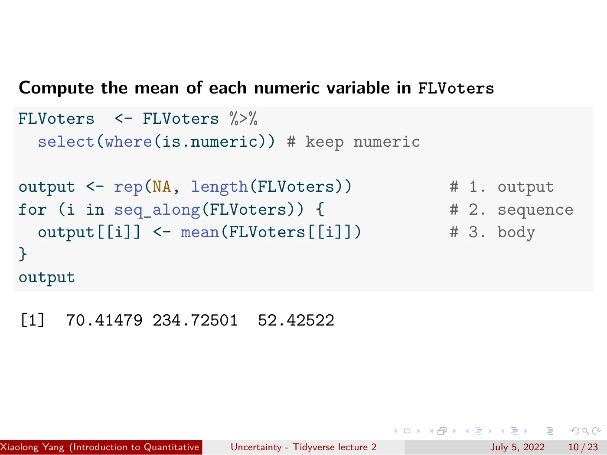
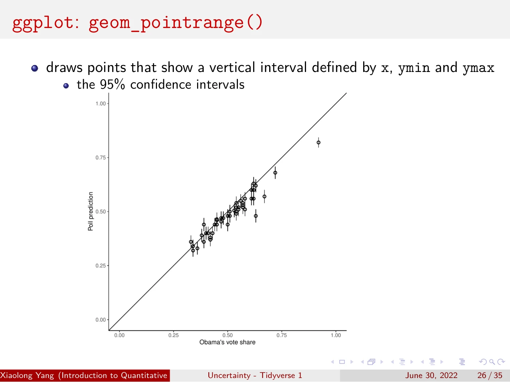
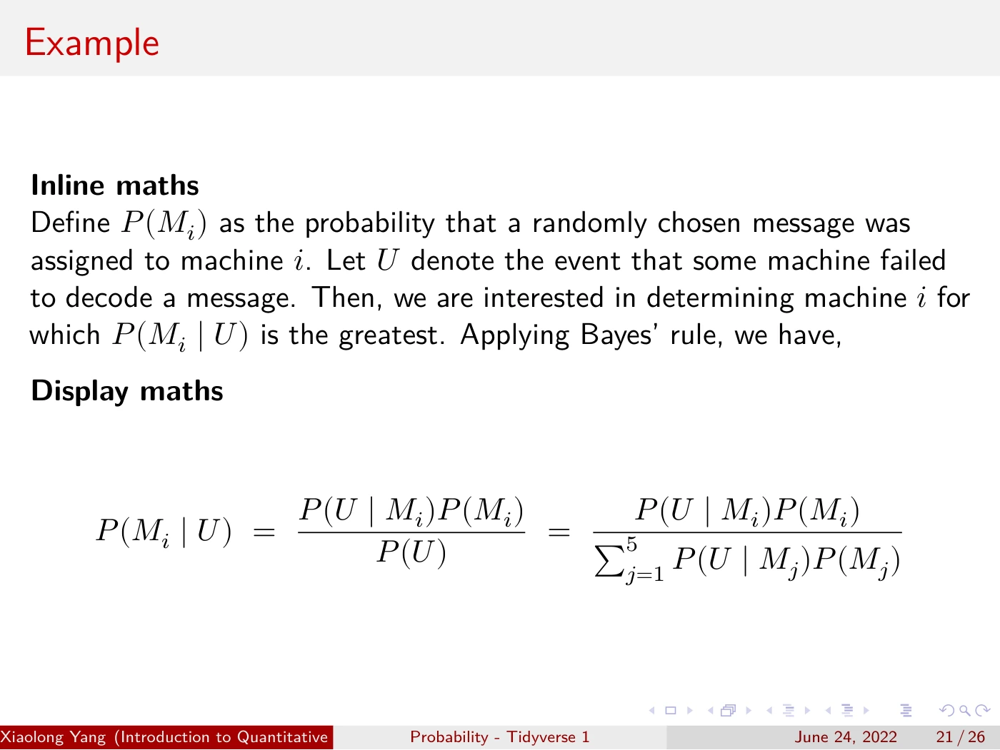

<nav class="site-nav" aria-label="Main navigation">
  <ul>
    <li><a href="/">Home</a></li>
    <li><a href="pdfs/Resume_XiaolongYang_27.pdf">Resume</a></li>
    <li><a href="research.html">Research</a></li>
    <li><a href="software.html">Software</a></li>
    <li><a href="teaching.html" aria-current="page">Teaching</a></li>
    <li><a href="bookshelf.html">Bookshelf</a></li>
    <li><a href="blog/">Blog</a></li>
    <li><a href="quotes.html">Quotes</a></li>
    <li><a href="beliefs.html">Beliefs</a></li>
    <li><a href="labs/">Maker Space</a></li>
  </ul>
</nav>
<main>
<header>
  <h1>Teaching</h1>
  
From running R code to understanding, reusing, and explaining it.

  
<strong>Quantitative Social Science</strong> · University of Tokyo · Summer 2022 Course assistant for Kosuke Imai. I taught tidyverse lectures for social science students.

  
<a href="https://kosukeimai.github.io/qss-todai/">Course</a><a href="https://github.com/xiaolong-y/qss-inst-tidyverse">Slides &amp; source code</a>

</header>
<section aria-labelledby="lecture-heading">
  
<h2 id="lecture-heading">What I taught, and how</h2>Original lecture slides · click to enlarge

  

    <article class="lesson">
      <h3>01 One operation, many columns</h3>
      
dplyr · across() · where()

      <figure>
        
        <figcaption>
          
I started with repeated summaries of Florida voter data, then replaced them with <code>across()</code>. Same calculation; less repetition.

          
<a href="https://raw.githubusercontent.com/xiaolong-y/qss-inst-tidyverse/main/Probability/pdf_slides/probability-tidy-1.pdf#page=9">Probability I · PDF p. 9 ↗</a>

        </figcaption>
      </figure>
    </article>
    <article class="lesson">
      <h3>02 Give repeated code a name</h3>
      
Functions · arguments · code style

      <figure>
        
        <figcaption>
          
A copy-paste error made the case for functions. We then built one in three steps: name, inputs, body.

          
<a href="https://raw.githubusercontent.com/xiaolong-y/qss-inst-tidyverse/main/Probability/pdf_slides/probability-tidy-2.pdf#page=8">Probability II · PDF p. 8 ↗</a>

        </figcaption>
      </figure>
    </article>
    <article class="lesson">
      <h3>03 See what the code works on</h3>
      
Vectors · lists · data frames

      <figure>
        
        <figcaption>
          
I compared atomic vectors and lists side by side, using code and its output to connect data types to their structure.

          
<a href="https://raw.githubusercontent.com/xiaolong-y/qss-inst-tidyverse/main/Uncertainty/pdf_slides/uncertainty-tidy-1.pdf#page=5">Uncertainty I · PDF p. 5 ↗</a>

        </figcaption>
      </figure>
    </article>
    <article class="lesson">
      <h3>04 Build a loop, then generalize</h3>
      
For loops · functionals · purrr

      <figure>
        
        <figcaption>
          
I unpacked a loop into output, sequence, and body. We then generalized column means to other summaries by passing a function as an argument.

          
<a href="https://raw.githubusercontent.com/xiaolong-y/qss-inst-tidyverse/main/Uncertainty/pdf_slides/uncertainty-tidy-2.pdf#page=10">Uncertainty II · PDF p. 10 ↗</a>

        </figcaption>
      </figure>
    </article>
    <article class="lesson">
      <h3>05 Make uncertainty visible</h3>
      
ggplot2 · intervals · facets

      <figure>
        
        <figcaption>
          
I paired plotting syntax with the figure it produces: vote-share predictions and 95% confidence intervals, followed by faceting examples.

          
<a href="https://raw.githubusercontent.com/xiaolong-y/qss-inst-tidyverse/main/Uncertainty/pdf_slides/uncertainty-tidy-1.pdf#page=26">Uncertainty I · PDF p. 26 ↗</a>

        </figcaption>
      </figure>
    </article>
    <article class="lesson">
      <h3>06 Write the reasoning, too</h3>
      
R Markdown · LaTeX · Bayes’ rule

      <figure>
        
        <figcaption>
          
Using the Enigma decoding problem, I showed mathematical source and rendered notation, then how prose and code share one document.

          
<a href="https://raw.githubusercontent.com/xiaolong-y/qss-inst-tidyverse/main/Probability/pdf_slides/probability-tidy-1.pdf#page=21">Probability I · PDF p. 21 ↗</a>

        </figcaption>
      </figure>
    </article>
  

</section>
<section class="practice" aria-labelledby="practice-heading">
  <h2 id="practice-heading">Then, put it to work.</h2>
  
The lectures led into in-class QSS assignments: Enigma decoding, women in China, and the file-drawer problem. The sequence was concrete example → reusable idea → application.

</section>

Selected from my Probability and Uncertainty decks in our <a href="https://github.com/xiaolong-y/qss-inst-tidyverse">teaching team’s open materials</a>. Examples draw on QSS, <a href="https://r4ds.had.co.nz/">R for Data Science</a>, and <a href="https://adv-r.hadley.nz/">Advanced R</a>. Grateful to <a href="https://imai.fas.harvard.edu/">Kosuke Imai</a> and <a href="https://connorjerzak.com/">Connor Jerzak</a> for opportunities to learn and teach.

</main>

<dialog class="slide-dialog" aria-labelledby="slide-title">
  

<button type="button" autofocus>Close ×</button>

  
</dialog>

